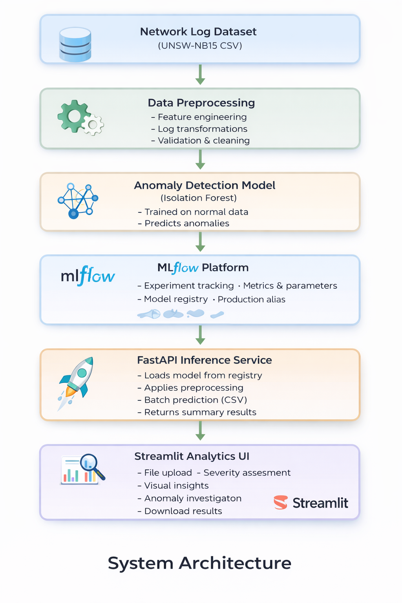
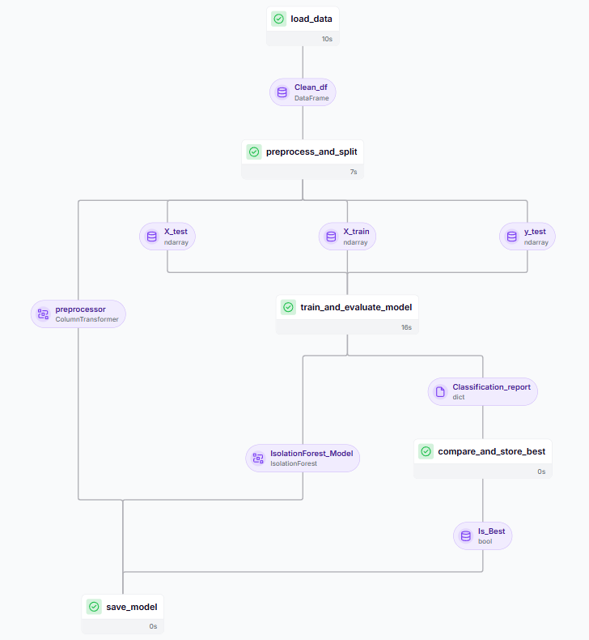
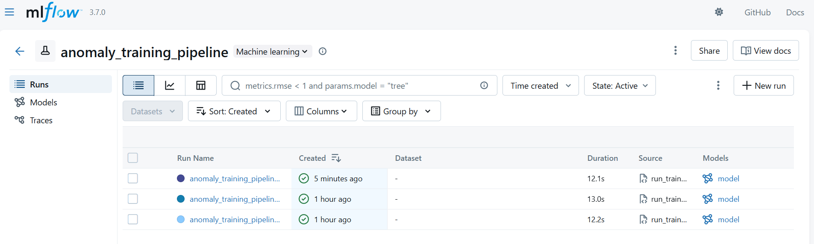
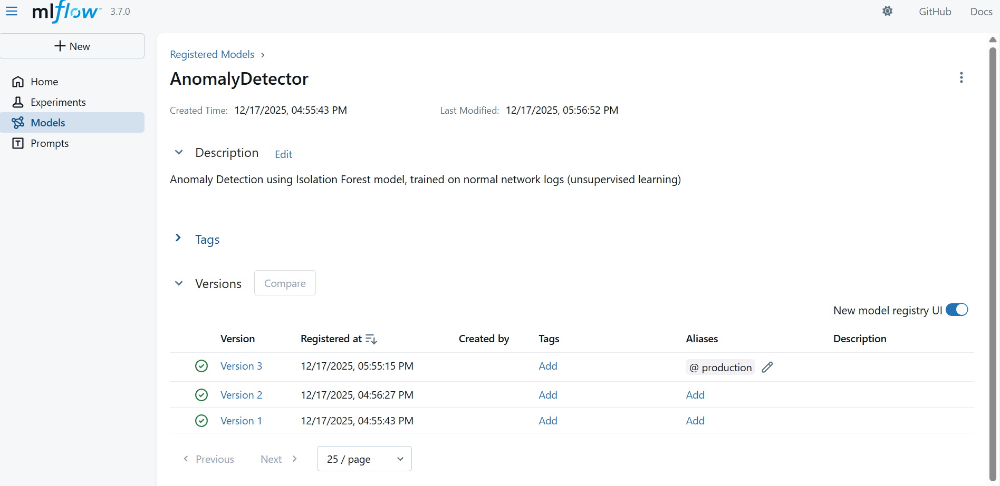

# Anomaly Detection in Cybersecurity Network Logs

An end-to-end **machine learning and MLOps project** for detecting anomalous network traffic using the **UNSW-NB15 dataset**.  
This project demonstrates how to design, train, deploy, and analyze an ML system in a **production-oriented setup**.


## Problem statement
The goal of this project is to build an AI-driven anomaly detection system that identifies unusual or potentially malicious activity in network traffic using the **UNSW-NB15 cybersecurity dataset**. By applying unsupervised machine learning method - **Isolation Forest**, the model learns normal network behavior and flags deviations that may indicate cyber threats or intrusions. This project demonstrates how machine learning can enhance network security and threat detection by analyzing high-dimensional network log data.

### Data Collection
UNSW-NB15 Cybersecurity Dataset : https://research.unsw.edu.au/projects/unsw-nb15-dataset

---
## What this project does

- Detects anomalous (suspicious) network connections using **unsupervised learning**
- Tracks experiments and models using **MLflow**
- Orchestrates training pipelines with **ZenML**
- Serves predictions via **FastAPI**
- Provides analyst-friendly insights through a **Streamlit dashboard**

### ML Approach

- **Model:** Isolation Forest  
- **Learning type:** Unsupervised anomaly detection  
- **Training strategy:** Train on normal traffic, detect deviations  
- **Output:** Normal / Anomaly

### Tech Stack

- **ML:** Python, Pandas, NumPy, Scikit-learn  
- **MLOps:** ZenML, MLflow  
- **Serving:** FastAPI  
- **UI:** Streamlit  

### System Architecture



### Project Structure

```
Anomaly-Detection-in-Cybersecurity-Network-Logs/
│
├── app/                          # FastAPI backend
│   ├── __init__.py
│   ├── main.py                   # /predict API (CSV upload → inference)
│   └── schemas.py                # Request/response schemas
│
├── src/                          # Core ML pipeline logic
│   ├── pipelines/
│   │   ├── __init__.py
│   │   ├── training_pipeline.py  # ZenML training pipeline
│   │   └── deployment_pipeline.py# ZenML deployment pipeline (registry-based)
│   │
│   ├── steps/
│   │   ├── __init__.py
│   │   ├── data_loader.py        # Data ingestion
│   │   ├── preprocess_split.py   # Feature engineering + preprocessing
│   │   ├── train_and_eval.py     # Model training + evaluation
│   │   ├── best_model_selector.py# Best model selection logic
│   │   ├── model_saver.py        # Artifact-based model saving (fallback)
│   │   └── deployment_loader.py  # Load deployable model
│
│   └── tests/                    # Unit tests for data loading, prepocessing, model training and evaluation steps
│       ├── __init__.py
│       └── test_loader.py         
│       ├── test_preprocessor_split.py
│       └── test_train_and_eval.py         
│
├── streamlit_app/                # Frontend UI
│   └── app.py                    # Upload CSV + visual analytics dashboard
│
├── notebook/                     # Exploratory & experimentation notebooks
│   ├── EDA.ipynb
│   ├── enhanced_model.ipynb
│   └── model_training.ipynb
│
├── artifacts/                    # Saved models & preprocessors
│   ├── model.pkl
│   └── preprocessor.pkl
│
├── mlruns/                       # MLflow experiments (local tracking)
|
├── .zen/                         # zenml config
│
├── assets/                       # Screenshots of zenml pipeline, mlflow experiments, logging and model registry
│      
├── data/                         # Dataset storage
│
├── run_training_pipeline.py      # Trigger ZenML training pipeline
├── run_deployment_pipeline.py    # Trigger deployment pipeline
│
├── requirements.txt              # Project dependencies
├── best_metrics.json             # Best model metrics snapshot
└── README.md                     # Project documentation

```


---

## ML Pipelines (ZenML + MLflow)

### Training Pipeline
- Data loading and validation  
- Feature engineering and preprocessing  
- Model training and evaluation  
- Experiment tracking using **MLflow**  
- Model registration in **MLflow Model Registry**

### Model Deployment Strategy
- Models are loaded from the **MLflow Model Registry** using the `production` alias  
- Artifact-based model loading is used as a fallback mechanism when required  

### Pipeline Artifacts

#### Training Pipeline (ZenML)


#### Experiment Tracking (MLflow)


#### Model Registry



---

## Inference API (FastAPI)

### Endpoint

POST /predict

**Input:**  
- CSV file containing network traffic logs

**Output:**  
- Total records processed  
- Number of anomalies detected  
- Number of normal records  
- Limited preview of predictions (for scalability)

**API Docs:**  http://127.0.0.1:8000/docs

---

## Streamlit Dashboard

The dashboard enables interactive analysis by providing:
- CSV upload and inference trigger
- Summary metrics
- **Severity score (%) with risk interpretation**
- Anomaly distribution visualization
- Table of detected anomalous records
- Downloadable prediction results

---

## Running the Project Locally

### Set up virtual environment
```bash
python -m venv venv
venv\Scripts\activate
```
### Install dependencies
```
pip install -r requirements.txt
pip install "zenml[server]"
```
### Initialize ZenML
```
zenml init
zenml up --blocking
```
ZenML Dashboard:
http://127.0.0.1:8237

### Run training pipeline
```
python run_training_pipeline.py
```
This will:
- Execute the full ML pipeline using ZenML
- Log experiments, metrics, and artifacts to MLflow
- Register the best model in the MLflow Model Registry

MLflow UI:
http://127.0.0.1:5000

### Start FastAPI Inference service
```
uvicorn app.main:app --reload
```
API Docs (Swagger):
http://127.0.0.1:8000/docs

### Launch Streamlit dashboard
```
streamlit run streamlit_app/app.py
```
Streamlit UI:
http://localhost:8501

---

## What This Project Demonstrates

- End-to-end ML system development
- Practical MLOps with **ZenML and MLflow**
- Model registry–based deployment
- Production-style API design
- Outcome-focused analytics for anomaly detection
